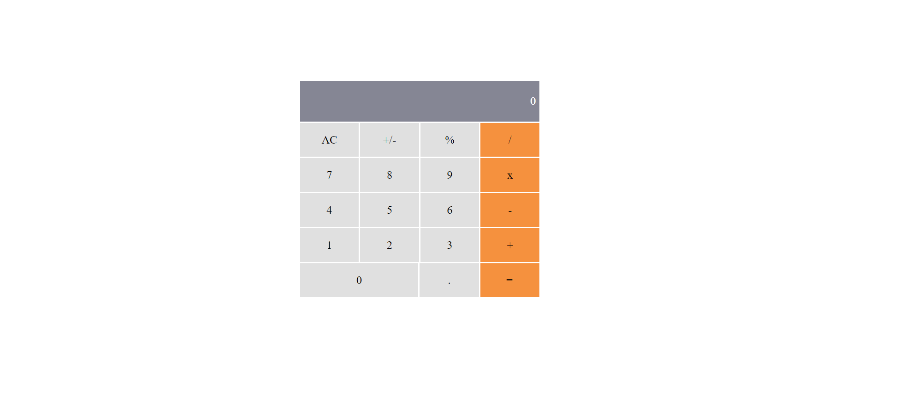

## Math Magicians

## Getting Started
Math Magicians is a website for all fans of mathematics. It is a Single Page App (SPA) that allows users to:
Make simple calculations.
Read a random math-related quote.

### Prerequisites
Install linters
Install React App
### Setup

### Install
npx create-react-app 
cd my-app
### Usage

### Run tests
npm start
### Deployment

## Authors

👤 **Bwalya Nonde**

- GitHub: [@githubhandle](https://github.com/BwalyaNonde)
- Twitter: [@twitterhandle](https://twitter.com/nonde_bwalya)
- LinkedIn: [LinkedIn](https://www.linkedin.com/in/bwalya-nonde-5865601a9/)

## 🤝 Contributing

Contributions, issues, and feature requests are welcome!

Feel free to check the [issues page](../../issues/).

## Show your support

Give a ⭐️ if you like this project!

## Acknowledgments

- Hat tip to anyone whose code was used
- Inspiration
- etc

## 📝 License

This project is [MIT](./MIT.md) licensed.
